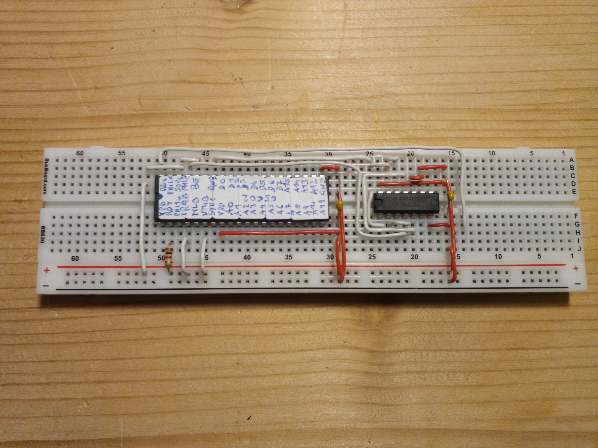

# 65c02

The 6502 is one of the best known 8-bit processors as various variants of it were used in many 8-bit computers of the 80th.
Apple, Commodore, Atari, Acorn and many other manufacturers used this CPUs to drive their products.
Genuine old parts may probably be difficult to get, but luckily there is a not-so-modern variant that is still in production: WD65c02.

It is relatively simple to wire up this chip to the ByteMachine. You basically need one additional 74HC00 chip (quad NAND). In my tests, this 
setup is able to run at 16Mhz without any issue. Even 20Mhz were possible with a bit of extra parts to tweak the timings of the WR and RD signals,
but this is not really reliable. 

The schematic diagram (65c05board.pdf) is designed to directly show the breadboard layout. The connections of some bus lines 
are only shown by their designators to avoid too much clutter in the diagram.

## Control signal generation

The 65c02 provides a different set of control lines to access the memory than the main board expects. It basically just generates a single 
RWB signal which tells the rest of the system if the current CPU cycle is meant to read from memory or write to it.
The main board on the other hand expects explicit RD and WR pulses for each access and does not care itself for the CPU clock
(it generates the clock, but does not use it itself in any way). To produce the correct WR and RD pulses, the CPU board 
needs 3 NAND-gates to join together the clock and the RWB line to create the necessary half-cycle long negative-going pulses.

## Memory map

The 64K address space which the 65C02 can access using its 16 address lines are translated to the address spaces of the ByteMachine in the following way:

| CPU address| type | mem address  |
| ---------- | ---- | ------------ |
| 0000..7FFF | RAM  | 68000..6FFFF | 
| 8000..FFFF | ROM  | 68000..6FFFF | 

I intentionally use just this portion of the ROM so other areas can be used for different CPU boards without the
need to overwrite this area.

## More possibilities

With additional 74-series logic it is surely possible to implement some kind of bank switching scheme to access a larger area 
of the ByteMachine's total address space. This is open to experiment by anyone who wants to try.

