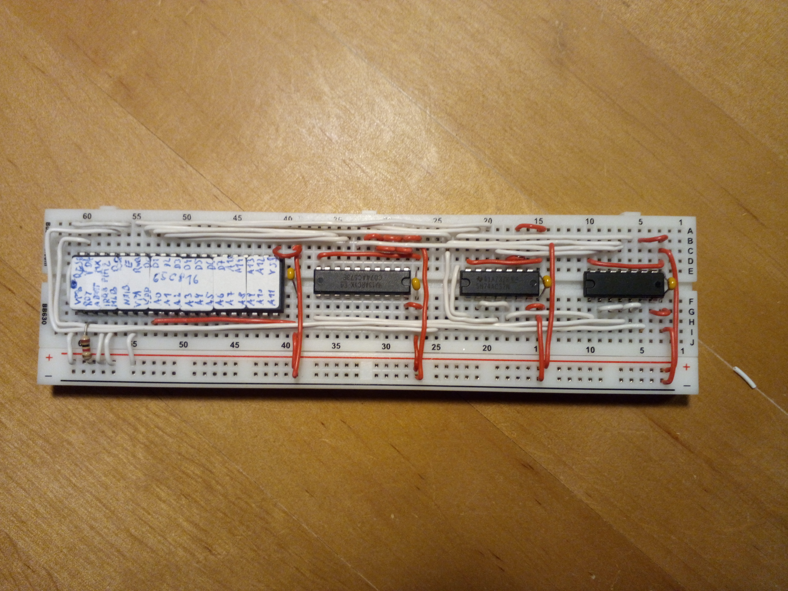

# 65c816

This not so well known CPU is an extended variant of the 6502. It extends the address space to 24 bit
and some internal registers can be used with a width of 16 bit.
It was used in the Super Nintendo Entertainment System (SNES) as well as the Apple IIGS, but it was never
very accessible to hobby programmers back in the day. Even for todays hardware DIY fans this CPU 
is quite tricky to use because of its multiplexed data bus and other details.

## Theory of operation

The main problem when using this CPU is the way in which the high address lines are multiplexed on the data lines.
With the use of a latch and two more 74-series logic parts (one quad NAND and one quad OR), this can be solved.
Generation of RD and WR signals is done in the same way as on the 65C02 board. To avoid bus collisions during the
first half of each cycle as much as possible, the CPU is driven with a slightly delayed clock so the time spans where the 
CPU writes the higher address lines to the data bus do least overlap with the time spans when the memory writes 
back the data. With this simple circuit, collisions can not be entirely avoided, but it seems to be OK
to have collisions for only a few nanoseconds on each clock cycle.

The schematic diagram (65c816board.pdf) is designed to directly show the breadboard layout. The connections of some bus lines 
are only shown by their designators to avoid too much clutter in the diagram.

## Memory map

The 16M address space which the 65c816 can access is larger than the total available RAM and ROM space of the 
main board, so many addresses map to the same target locations. 
After reset (in "emulation mode"), the CPU is reading the reset vector from bank 0 and the startup code also can only be located in this bank. 
But in normal operation it would be beneficial to have the whole bank 0 available for RAM.
Therefore the board uses the "emulation" output pin to provide two different memory mappings. One solely for 
the purpose of bringing the CPU up into native mode. In this emulation mode, all addresses only  map
to the ROM and not much meaningful work can be done (except switching to native mode).

Memory map

| CPU address    | type   | mem address  |
| -------------- | -------| -------------|
| 000000..07FFFF | RAM(*) | 00000..7FFFF |
| 800000..87FFFF | ROM    | 00000..7FFFF |

(*) In emulation mode this memory range also maps to ROM. 
