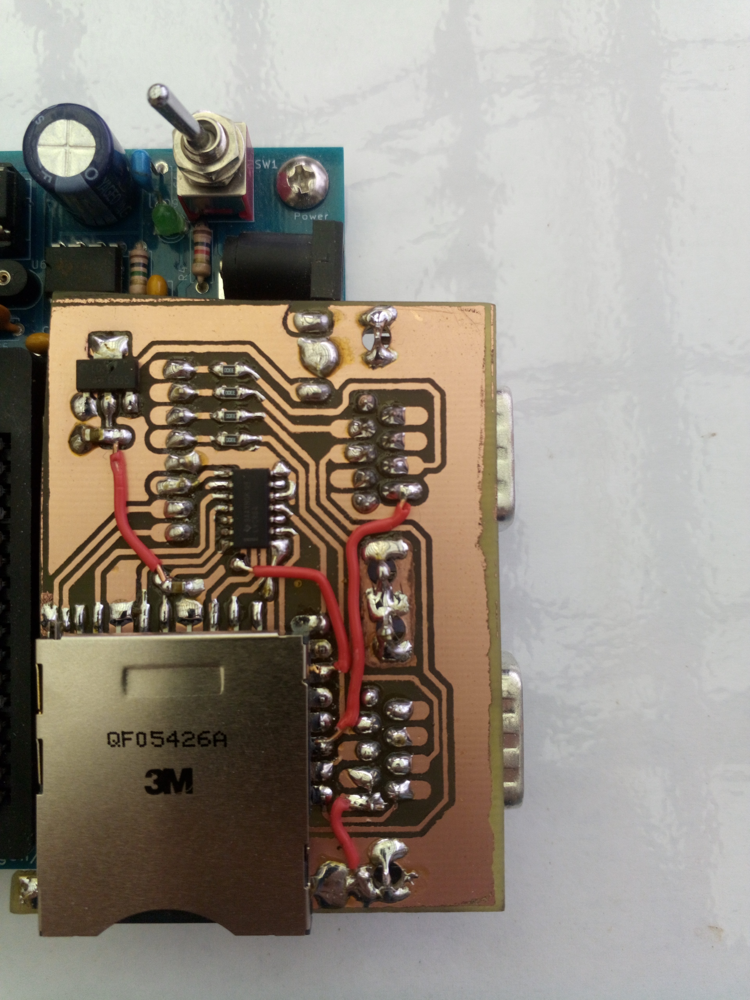

# IO expander

To allow more sophisticated communication with the outside world than just blinking lights and buttons, 
a small IO board can be attached to the headers of the IO area. This boards provides two serial communication
ports and one SDcard socket.

## Serial ports

Using 4 output pins and 4 input pins, 2 independent serial ports (DSUB-8 connectors) can be
controlled. Because the system architecture of the ByteMachine does not support interrupts,
the CPU will periodically poll the incomming data. This is made possible by the hardware 
handshake with RTS/CTS lines which allows the communication partner to only send data while the 
CPU is actively listening.

## SD card interface

With 3 output pins and 3 input pins, the SD card socket can be driven and there are even
connections to check for the presence of an SD card and for the write-protection switch as well.
Voltage level shifters are used to translate the 5V of the main board to the 3.3V necessary for 
interfacing the SD card itself.

