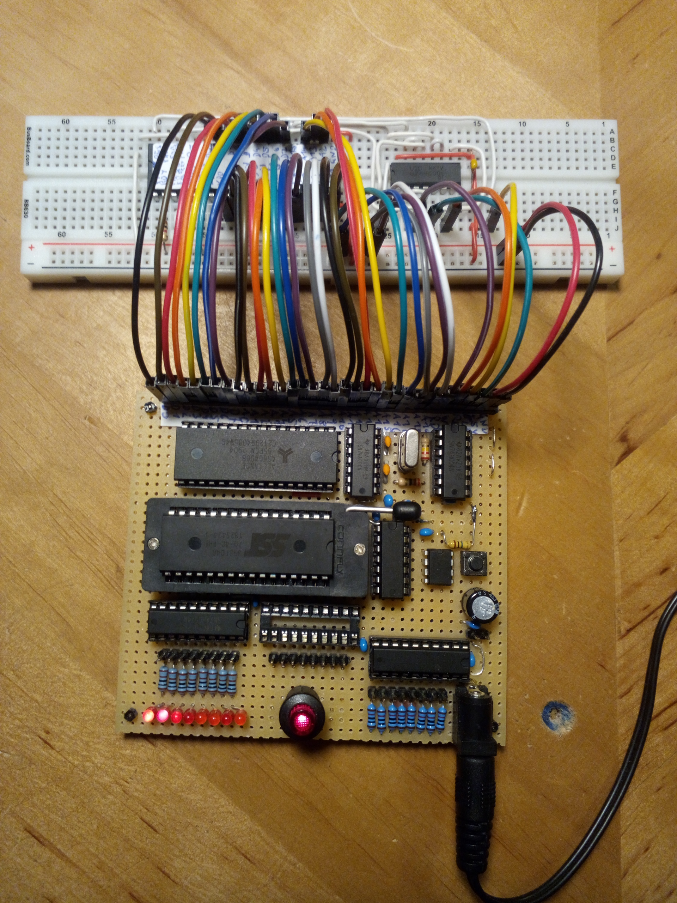

# ByteMachine

Building an 8-bit computer is not exactly trivial. There are always many components involved which are normally
connected to some common address and data bus with complex control signal timings for RAM, ROM and IO controller parts and
whatnot.

One common way for a hobbyist user to actually build such a contraption is using a pre-engineered PCB on which to 
solder all necessary parts. While this can be great fun in itself, it does not teach you much about the hardware 
beyond basic soldering skills. 

Another way is creating the whole computer totally on breadboards. There are great resources and instructions available for
this and it may actually give you the best learning experience. On the other hand, creating a huge breadboard circuit comes with
its own troubles. The cables will often become a total mess, you easily disturb the wrong wires while changing anything, some wires
may make bad contact and you may not get the machine to run at a higher system clock.

With this design as a building block, I wanted to provide some kind of middle ground. The PCB provides the circuity for the system bus, RAM, ROM, clock, powerup reset 
and rudimentary IO. You then need to add a relatively small circuit for the CPU board, depending on the type of CPU to use. This can
be easily done with a single breadboard and a series of jumper links connecting this with the main board. In my experients this creates a 
pretty reliable setup which is even able to use clock frequencies of up to 16Mhz (for the 65Cxx types of CPUs).
Currently I have built and tested setups for the following CPUs:
* [65C02](65c02)
* [65C816](65c816)
* [Z84C00](z84c00)
* [i8088](i8088)

## CPU board connector

The main board has a 34 pin single-row connector that carries power and all signals necessary for the CPU to send and receive:
* Power connectors GND and +5V
* CPU Clock 
* Reset (active low)
* WR (active low)
* RD (active low)
* ROM selector 
* 19 Address bus lines
* 8 Data bus lines (bidirectional)

## Clock generator

The main board provides a simple circuit to create a clock signal using a quartz crystal. The quartz itself is socketed, so
you can easily exchange it to experiment with different frequencies. In my tests, this circuit runs reliably with frequencies
from 8Mhz up to 20Mhz (but this may be too fast for your CPU).

## Power-on reset

Most (probably all) supported CPUs need some external help to cleanly start upon power-up. The power-up reset line provides a
low level signal for the first few milliseconds after power is available. 

## Reading and writing strobes

Beyond providing the CPU clock, the main board itself does not use this clock for anything itself, and all accesses to
both RAM, ROM and IO are triggered by asynchronous signals. 

When the CPU needs to do a read, it sets up the address lines as 
well as the ROM selector and then pulls the RD line low. As long as this is in its low state, the board will provide
the requested data on the data bus. It is in the responsibility of the CPU to never drive the data bus itself as long as
the RD line is low.

For writing data to the board, the CPU needs to provide both the address (and ROM selector) and the data on the data bus.
Then it needs to pull WR low and set it high again (after some minimum setup-time). The data that is present at the rising 
edge will be written to the RAM (or IO).

## ROM, RAM, IO

The main board contains 512K of RAM, 512K of ROM (actually a NAND-Flash IC in a ZIF socket for ease of re-programming)
and two 74-series logic ICs to drive the input and output interface.

Contrary to most 8-bit computer designs, there is no dedicated address space to access IO (memory mapped IO) as this would
require some complex address decoding logic. Also a dedicated IO space would reduce the address space available, and for 
a CPU with only 16 address lines total, this is a serious drawback.

In my solution, the only IO the CPU can do is to write into an 8-bit output port register and to read 8 bits from an input 
port. Writing to the output is simply done by writing anywhere to the ROM address range. The data byte written will be stored
in the output register and will show up as voltages on the output port and will also directly drive the output LEDs.
To also allow input with as little logic parts as possible, I chose the following mechanism: 
After a write to the ROM area (and in consequence to the output port as well), the main board switches to "IO mode".
In IO mode, all reads from the RAM area will instead read data form the input port. 
To switch back to normal mode, the CPU needs to do a write to any RAM address. 
Using this scheme, the full range of ROM and RAM is available, as well as 8 output lines and 8 input lines.

## Attaching IO 

With a total of 8 output lines and 8 input lines (each with 10K pullups), basically any kind of serial IO protocol can be implemented
by the CPU: SPI, I2C, UART.

To keep things simple, the ByteBoard does not directly support any kind of IO interrupt line. Therefore basically only IO 
schemes are possible where the CPU is the master of the timing. This is already an inherent characteristic of the I2C and SPI
bus. To implement reliable UART communication, the connected device must support hardware flow control (RTS/CTS) at least 
on the incomming signal, so the CPU needs only to listen for data when it is itself prepared for that.

## Bidirectional lines for I2C 

To form the bi-directional line that is needed for I2C, one output and one input line can be combined.
The output pin can for example drive an open-collector circuit (an IC or only a simple transistor circuit). An even 
simpler possibility is just a diode that pulls down the line when the output pin is driven low, but lets the line
float when the pin is driven high. Due to the pullup resitors already present at the input port pins, this is
basically all that is needed.

## Reprogamming the Flash

From the perspective of the ByteMachine, its ROM is truly read-only. So you need an external programming device
to get new content onto the NAND-Flash. I am using an TL866II+ device which works absolutely fine for me. But 
any other compatible programmer will work, and you can even create an Arduino-Based circuit for that. 
