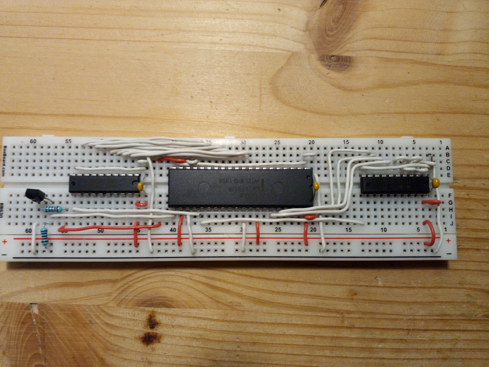

# i8088

The Intel 8088 was the processor that powered the original IBM PC and XT. While the processor has a 16-bit
architecture identical to the 8086, it was stripped down to access the bus only with 8 data bits.
As it also can access a total address range of exactly 1 megabyte this now is the perfect match for the ByteMachine.

## Control signals

To keep the pin count down to 40, the processor multiplexes many address lines with other signals. Therefore 
two latch ICs are needed to store this part of the address. Conveniently the processor already provides the signal
to control the latches and also the WR and RD strobes to access the RAM and ROM. Also the ByteMachine's memory
map can be directly used by the 8088 (startup ROM is in high address range).

The only inconvenience here is the fact that the 8088 needs its reset as active high. So just one additional 
inverter is needed which I implemented with a simple transistor circuit.

## Memory map

The 1M address space directly translates to the ByteMachine in the most natural way way:

| CPU address  | type | mem address  |
| ------------ | ---- | ------------ |
| 00000..7FFFF | RAM  | 00000..7FFFF | 
| 80000..FFFFF | ROM  | 00000..7FFFF | 
