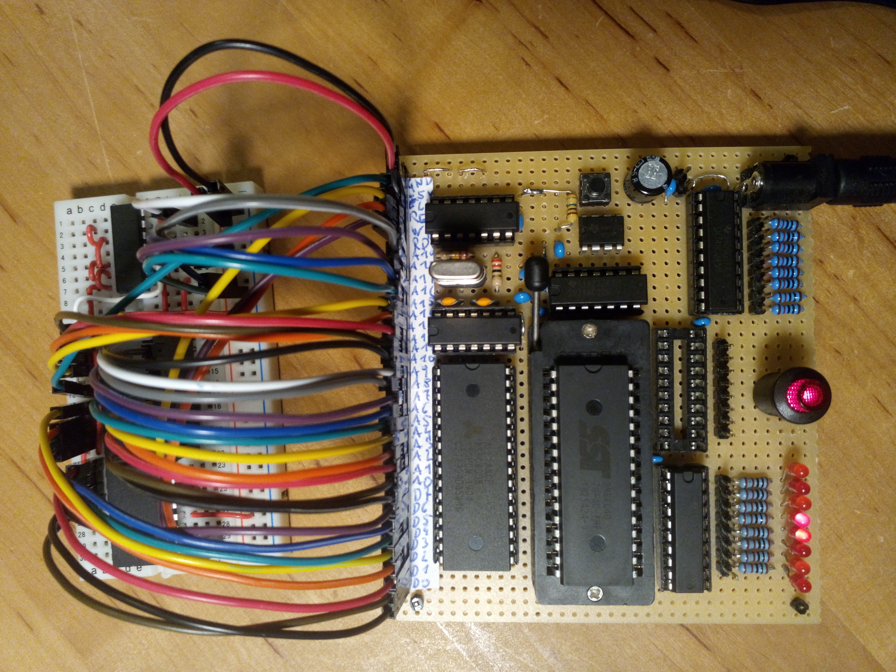

# z84c00

The Z80 was a very prominent 8-bit microprocesser in the 1970es and 1980es with many applications in arcade games, home computers
and gaming consoles as well as embedded controller for many products.

It is pretty simple to wire this CPU to the ByteMachine, as it already produces the exact RD and WR signals needed to
drive the interface. With this circuit it is possible to directly access 32K of RAM and 32 of ROM.
Because only the minium number of wires is used, there is no distinction between memory access and IO 
accesses - so both will just go to the general address space of the ByteMachine. 

## Memory map

The 64K address space which the Z80 can directly access using its 16 address lines are translated 
to the address spaces of the ByteMachine in the following way:

| CPU address| type | mem address  |
| ---------- | ---- | ------------ |
| 0000..7FFF | ROM  | 70000..77FFF | 
| 8000..FFFF | RAM  | 70000..77FFF | 

I intentionally use just this portion of the ROM so other areas can be used for different CPU boards without the
need to overwrite this area.

## More possibilities

Using the IO commands of the processor and implementing some logic using the IOREQ output
it would be relatively easy to access more ranges of ROM and RAM.  

A totally minimalistic possiblity to make the breadboard circuit as small as possible, would be to leave out the 
NAND-gate and connect the ROM line to the IOREQ# output of the CPU. This would allow program
exectution from 64K of ROM, but no RAM is then available in the normal address space. You can 
access the RAM only using the dedicated IO instructions.
